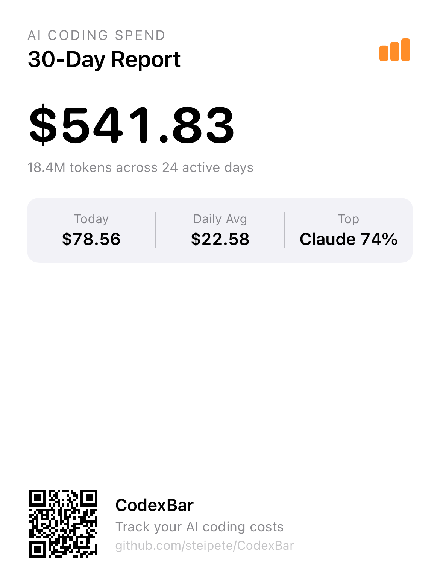
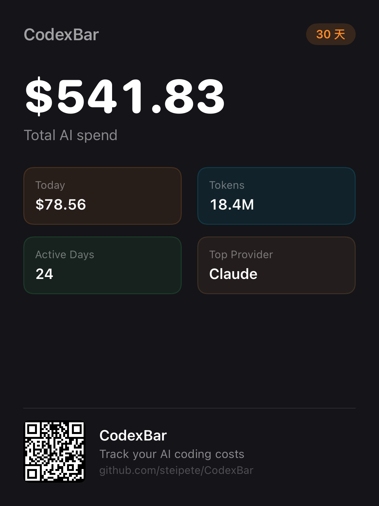
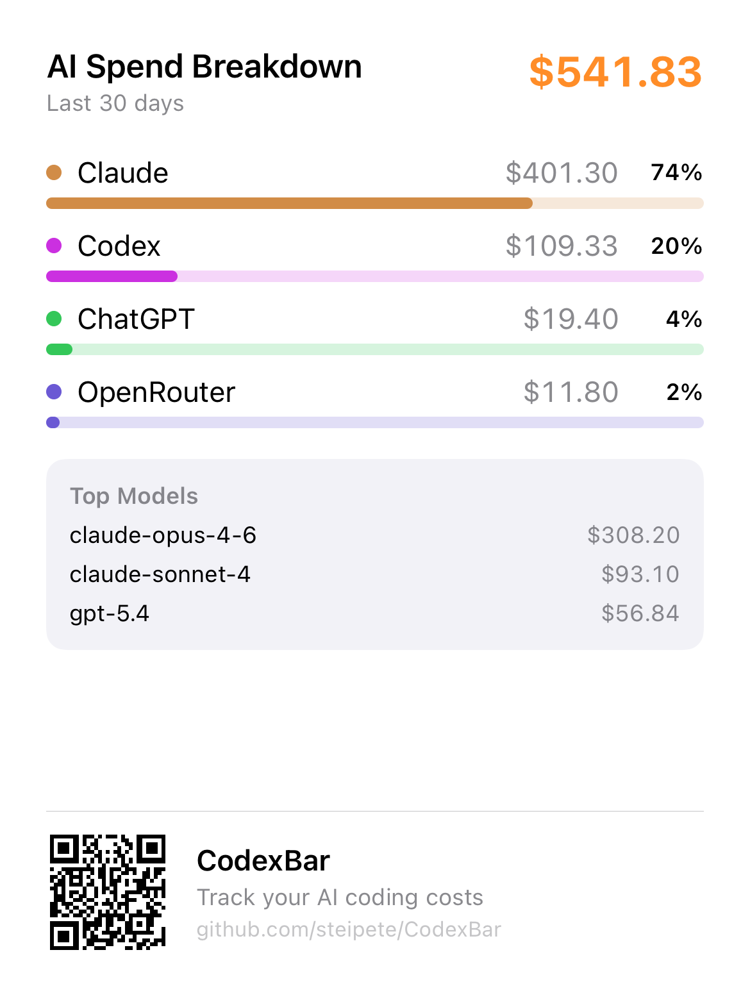
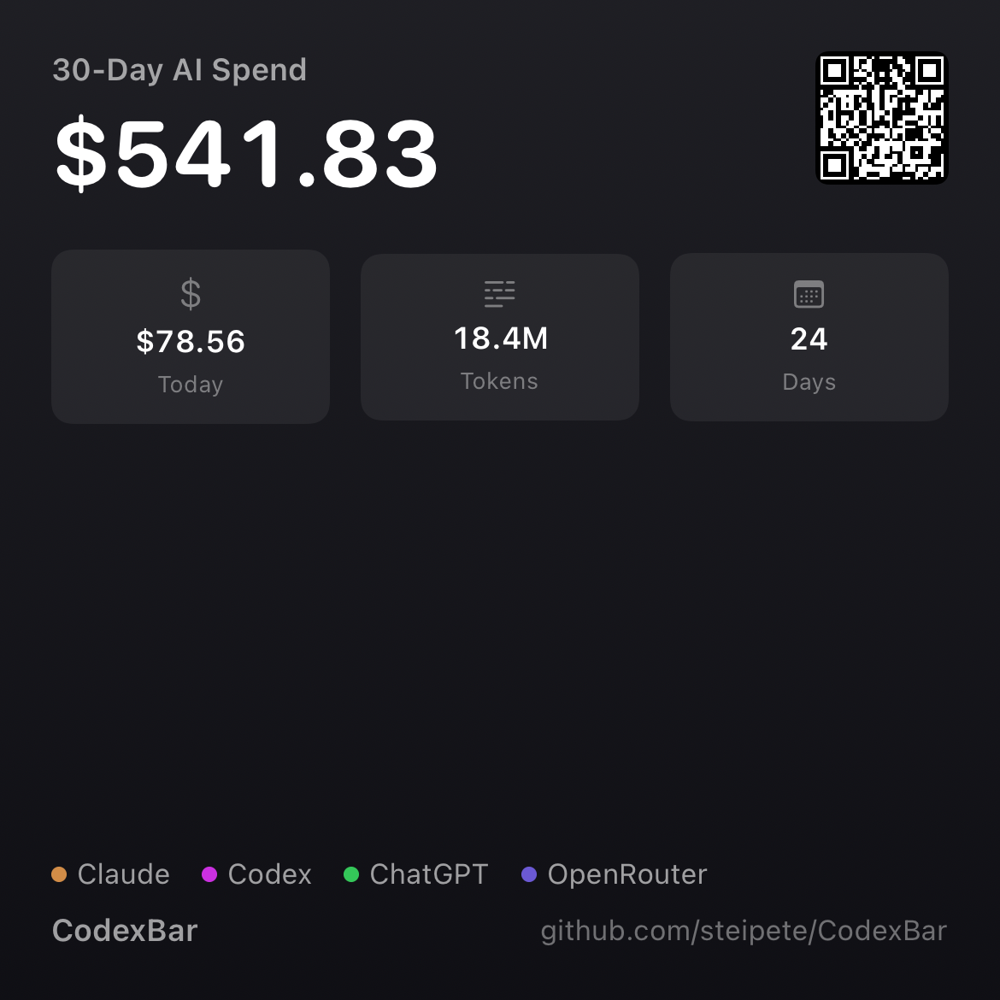
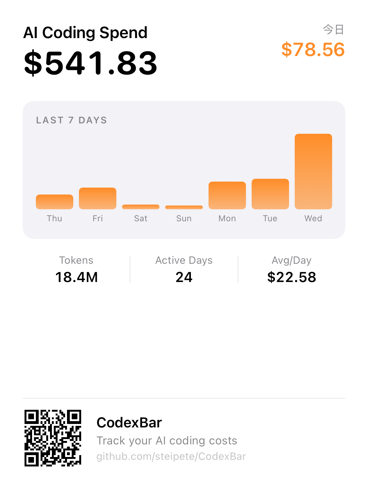
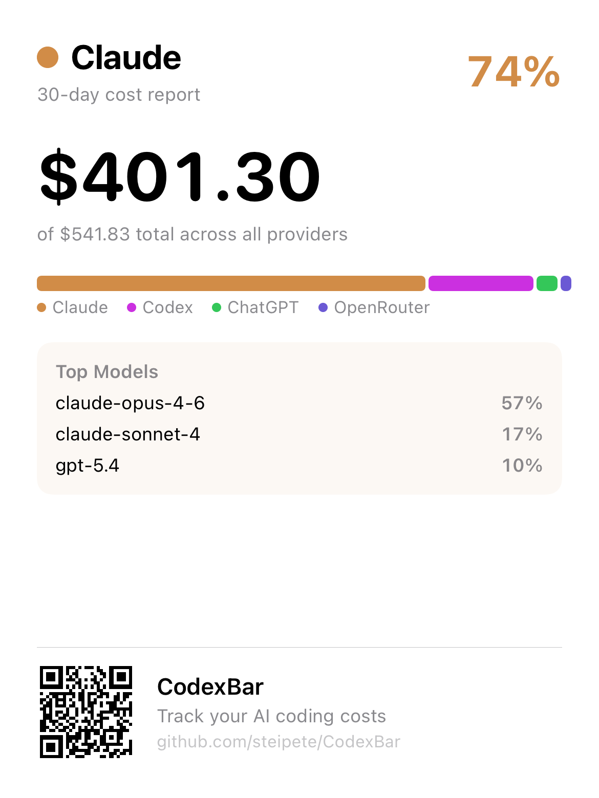
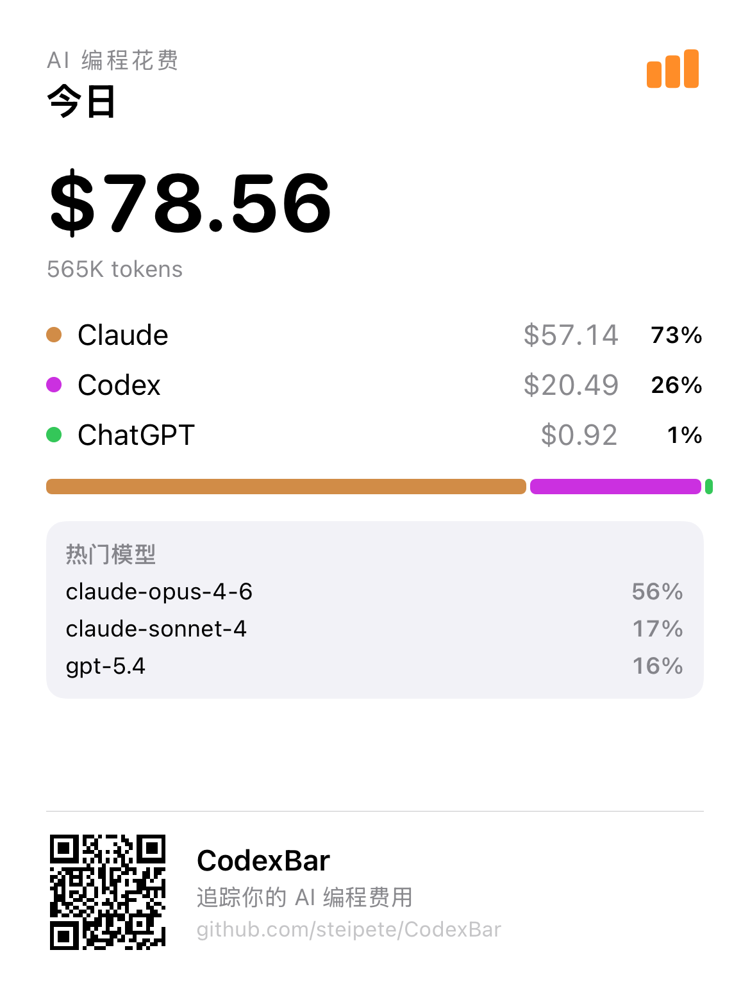
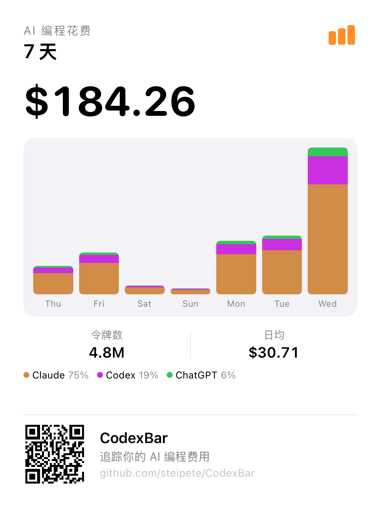
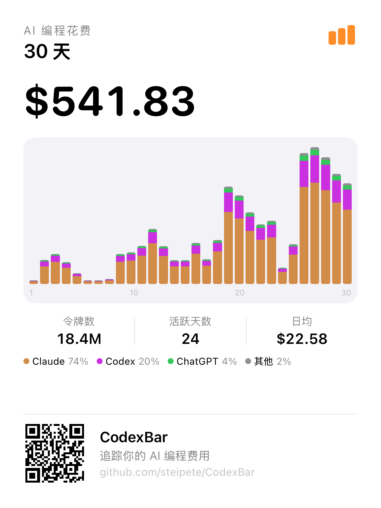

# 002 — Cost Share Card (One-Tap Share)

- **Status:** `done`
- **Created:** 2026-03-19
- **Updated:** 2026-03-19

## Summary

Add a "Share" button to the Cost tab that generates an elegant image summarizing the user's AI spending, with a QR code at the bottom linking to CodexBar. User picks a time range (Today / 7 Days / 30 Days) before sharing.

## Final Design Decision

Three share modes, based on two selected styles from the initial exploration:

| Mode | Period | Base Style | Content |
|------|--------|------------|---------|
| **Today** | 1 day | Style 7 (Provider) | Today's total, provider breakdown with share bars, top models |
| **7 Days** | 7 days | Style 6 (Chart) | 7-day bar chart, total cost, daily avg, tokens |
| **30 Days** | 30 days | Style 6 (Chart) | 30-day bar chart, total cost, active days, tokens |

Card size: fixed 390×520pt (1170×1560px @3x). No expansion — if content doesn't fit, omit it.

## Style Exploration (completed)

7 candidate styles were designed, rendered, and evaluated:

| # | Style | Decision | Reason |
|---|-------|----------|--------|
| 1 | Clean Light | `dropped` | Too sparse, large empty space |
| 2 | Dark | `dropped` | Good look but no chart/breakdown |
| 3 | Gradient | `dropped` | Visually striking but low information density |
| 4 | Breakdown | `dropped` | Data-rich but no trend chart |
| 5 | Compact (Square) | `dropped` | Too small for detailed data |
| 6 | **Chart** | **selected** | Used for 7-day and 30-day modes |
| 7 | **Provider** | **selected** | Used for today mode |

### Rendered previews (for reference)

| Style | Preview |
|-------|---------|
| ~~1. Clean Light~~ |  |
| ~~2. Dark~~ |  |
| ~~3. Gradient~~ |  |
| ~~4. Breakdown~~ |  |
| ~~5. Compact~~ |  |
| **6. Chart** |  |
| **7. Provider** |  |

## Implementation

### Files

| File | Purpose |
|------|---------|
| `Views/CostShareCardView.swift` | 3 share card views (today/week/month) |
| `Models/CostShareService.swift` | QR generation, ImageRenderer, share sheet, data model |
| `Tests/ShareCardRenderTests.swift` | Render test that outputs PNG to /tmp for visual QA |

### Technical approach

- `ImageRenderer` (iOS 16+) to render SwiftUI view → `UIImage`
- `CIQRCodeGenerator` (CoreImage) for QR code
- `UIActivityViewController` for share sheet
- All card views are self-contained (no environment dependencies)
- Share button in Cost tab → period picker sheet → renders + shares

### Share flow

```
User taps Share → Bottom sheet appears:
  ┌─────────────────────┐
  │  Share Cost Report   │
  │                      │
  │  [Today]  [7d]  [30d]│
  │                      │
  │  [Preview of card]   │
  │                      │
  │  [Share]             │
  └─────────────────────┘
```

## Data Available

| Data | Source | Used in |
|------|--------|---------|
| 30-day total cost | `CostDashboardInsights.total30DayCost` | 7d, 30d |
| Today's cost | `CostDashboardInsights.totalTodayCost` | Today |
| 30-day tokens | `CostDashboardInsights.total30DayTokens` | 7d, 30d |
| Active days | `CostDashboardInsights.activeDayCount` | 30d |
| Provider breakdown | `CostDashboardInsights.providerRows` | Today |
| Model breakdown | `CostDashboardInsights.modelRows` | Today |
| Daily spend trend | `CostDashboardInsights.dailyPoints` | 7d, 30d |

## Final Renders

### Today


### 7 Days


### 30 Days


## Tasks

- [x] Design 7 style candidates
- [x] Render and evaluate all styles
- [x] Select final styles (6 + 7)
- [x] Refactor code to 3 share modes (today/week/month)
- [x] Render and QA final 3 cards
- [x] Wire up to real `CostDashboardInsights` data
- [x] Integrate share button into Cost tab toolbar
- [x] Add period picker sheet (Today / 7 Days / 30 Days segmented + preview + ShareLink)
- [x] Add 4-language localization (11 new strings)
- [x] Stacked bars: largest provider at bottom (dataviz convention)
- [x] Provider cap: top 3 + "Others" for 4+ providers
- [x] All unit tests + UI tests pass
- [x] Simulator verification with demo data
